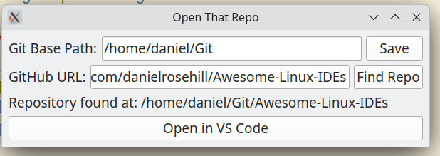

# Open That Repo

A desktop application that helps you quickly locate and open your local Git repositories using their GitHub URLs. If you have multiple Git repositories on your system and can't remember where a specific one is located, simply paste its GitHub URL and let Open That Repo find it for you.



## Features

- Search for local Git repositories using GitHub URLs
- Configure custom base directory for Git repositories
- Quick open in Visual Studio Code
- User-friendly PyQt6-based interface
- Persistent settings storage

## Requirements

- Python 3.x
- PyQt6 (>=6.0.0)
- Visual Studio Code (for the "Open in VS Code" feature)

## Installation

1. Clone this repository:
```bash
git clone https://github.com/yourusername/open-that-repo.git
cd open-that-repo
```

2. Install the required dependencies:
```bash
pip install -r requirements.txt
```

## Usage

1. Run the application:
```bash
python main.py
```

2. Configure your Git base path:
   - Enter the path where you store your Git repositories
   - Click "Save" to persist the setting

3. Find a repository:
   - Paste a GitHub URL (e.g., https://github.com/username/repo)
   - Click "Find Repo"
   - If found, the repository's local path will be displayed

4. Open in VS Code:
   - Once a repository is found, click "Open in VS Code" to launch it

## Configuration

The application stores its settings in `~/.config/open-that-repo/config.json`. The main setting is:
- `git_base_path`: The base directory where the application searches for Git repositories (defaults to `~/Git`)
 
